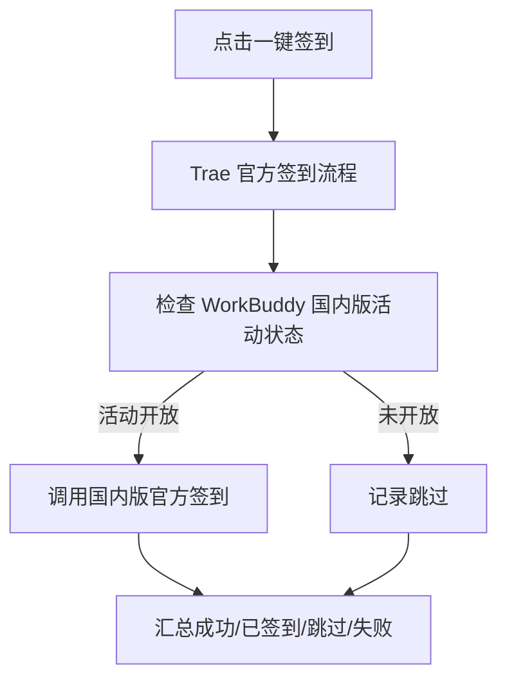

# AI-IDE-Manager

Antigravity、Trae、WorkBuddy AI（国际版）与 WorkBuddy（国内版）的本机状态、真实额度、官方签到、设备档案及模型网关控制台。

项目目录：

```text
D:\codex-projeect\antigravity-trae-manager
```

控制台默认地址：

```text
http://127.0.0.1:19999
```

## 1. 项目目标

本项目用于集中查看和管理本机已安装的 AI IDE：

- 读取各平台当前登录会话的真实状态。
- 展示官方返回的签到状态、奖励或剩余额度。
- 一键处理所有支持签到的平台。
- 严格区分 WorkBuddy AI 国际版与 WorkBuddy 国内版。
- 展示客户端官方活动中明确标为零倍率的限时免费模型。
- 管理本地设备标识、Trae 会话快照和独立多开目录。
- 将本机 WorkBuddy 国内版模型桥接为 OpenAI 兼容接口。

项目遵循以下真实性原则：

- 不使用固定数字伪造额度。
- 不把签到奖励当作账户余额。
- 不支持签到的平台明确显示“不支持”。
- 活动未开放时不调用领取接口。
- 上游请求失败时显示错误，不用本地假数据兜底。
- 免费模型必须来自官方活动数据中的零倍率标记，不能根据模型名称猜测。

## 2. 支持能力

| 平台 | 本机检测 | 真实额度 | 单独签到 | 一键签到 | 免费模型活动 | 登录切换 |
| :--- | :---: | :---: | :---: | :---: | :---: | :---: |
| ByteDance Trae | ✅ | 仅签到奖励，暂无余额接口 | ✅ | ✅ | 以 Trae 官方活动为准 | ✅ 已捕获快照 |
| WorkBuddy AI（国际版） | ✅ | ✅ | 不支持 | 不参与 | ✅ | 仅应用设备档案 |
| WorkBuddy（国内版） | ✅ | ✅ | 官方开放时启用 | ✅ 自动判断 | ✅ | 仅应用设备档案 |
| Google Antigravity | ✅ | ✅ 逐模型百分比 | 不支持 | 不参与 | 不适用 | 仅应用设备档案 |

“一键签到”只处理 Trae 与 WorkBuddy 国内版。WorkBuddy AI 国际版和 Antigravity 没有签到能力，不会出现在签到请求及结果中。

## 3. WorkBuddy 两个版本的区别

两个版本必须作为独立平台处理，不能混用程序、配置目录、登录会话或官方域名。

| 项目 | WorkBuddy AI（国际版） | WorkBuddy（国内版） |
| :--- | :--- | :--- |
| 平台标识 | `workbuddy-ai` | `workbuddy` |
| 程序 | `WorkBuddyAI.exe` | `WorkBuddy.exe` |
| 默认安装路径 | `D:\devloop-tools\workbuddyai\WorkBuddyAI.exe` | `D:\devloop-tools\WorkBuddy\WorkBuddy.exe` |
| 用户数据目录 | `%USERPROFILE%\.workbuddy-ai` | `%USERPROFILE%\.workbuddy` |
| 会话文件 | `workbuddy-desktop-ai.info` | `workbuddy-desktop.info` |
| 官方域名 | `https://www.workbuddy.ai` | `https://copilot.tencent.com` |
| 进程名 | `WorkBuddyAI.exe` | `WorkBuddy.exe` |
| CLI 命令前缀 | `wbai` | `wb` |

国际版套餐与积分规则以 [WorkBuddy 官方定价](https://www.workbuddy.ai/docs/zh/workbuddy/pricing) 为准。

## 4. 技术架构

### 4.1 技术栈

- Node.js 原生 HTTP 服务，不依赖 Web 框架。
- 原生 HTML、CSS、JavaScript 单页控制台。
- Node.js `fetch` 调用平台官方接口。
- Node.js `node:sqlite` 以只读方式读取 Antigravity 状态数据库。
- Windows 进程与本地配置文件检测。
- Node.js 内置测试运行器 `node:test`。
- OpenAI Chat Completions 兼容代理。

建议使用 Node.js 22.5 或更高版本。当前环境使用 Node.js 24。

### 4.2 模块关系

```text
浏览器控制台
    │
    ├── GET  /api/status
    ├── POST /api/checkin
    ├── POST /api/checkin/all
    ├── 账号、设备、进程管理接口
    └── OpenAI 兼容接口 /v1/*
             │
server.js ───┼── TraeManager
             ├── WorkBuddyManager(workbuddy-ai)
             ├── WorkBuddyManager(workbuddy)
             ├── AntigravityManager
             ├── AccountStore
             ├── 国内版官方模型 → WorkBuddy CLI 直连
             └── ProxyGateway → 本机 18888 自定义模型桥接
```

### 4.3 主要模块

| 文件 | 职责 |
| :--- | :--- |
| `server.js` | HTTP 服务、REST API、静态页面与网关路由 |
| `lib/account-store.js` | 本地档案、一键签到调度和结果汇总 |
| `lib/trae-manager.js` | Trae 安装检测、会话读取、设备档案和快照 |
| `lib/trae-crypto.js` | Trae 本地凭据解码和官方签到请求 |
| `lib/workbuddy-mgr.js` | 两个 WorkBuddy 版本的隔离配置、额度和签到 |
| `lib/antigravity-mgr.js` | Antigravity OAuth 会话及 Google 配额读取 |
| `lib/proxy-gateway.js` | OpenAI 兼容转发、模型目录和调用指标 |
| `public/index.html` | 页面结构 |
| `public/app.js` | 页面交互和接口调用 |
| `public/style.css` | 页面样式 |
| `cli.js` | 命令行管理入口 |

## 5. 真实数据来源

### 5.1 Trae

Trae 使用当前本机会话访问：

```text
/trae/api/v2/ug/checkin_credits/status
/trae/api/v2/ug/checkin_credits/claim
```

页面显示的数值是“今日官方签到奖励”，不是账户剩余额度。当前官方响应没有提供完整余额时，余额显示为 `--`。

### 5.2 WorkBuddy 系列

两个版本分别使用自己的会话和官方域名读取额度；签到接口只用于 WorkBuddy 国内版：

```text
/billing/meter/get-user-resource-summary
# 下面两个接口仅 WorkBuddy 国内版使用
/v2/billing/meter/checkin-activity-status
/v2/billing/meter/daily-checkin
```

额度计算规则：

```text
总量 = 所有 Packages 的 CycleTotalCapacity 之和
剩余 = 所有 Packages 的 CycleRemainCapacity 之和
已用 = 所有 Packages 的 CycleUsedCapacity 之和
```

### 5.3 Antigravity

Antigravity 从本机 `state.vscdb` 解码当前 OAuth 会话，然后调用 Google Cloud Code 官方接口：

```text
v1internal:loadCodeAssist
v1internal:fetchAvailableModels
v1internal:retrieveUserQuotaSummary
```

页面展示每个模型的 `remainingFraction` 转换后的百分比与重置时间，不换算成虚构积分。

Antigravity 没有官方签到能力，因此不提供单独签到入口，也不参与一键签到。

## 6. 一键签到流程

### 6.1 页面操作

1. 打开 `http://127.0.0.1:19999`。
2. 点击右上角“🎁 一键签到支持的平台”。
3. 确认操作。
4. 系统依次处理 Trae 与 WorkBuddy 国内版。
5. 完成后弹出逐平台结果及汇总。
6. 页面自动刷新额度与签到状态。

### 6.2 调度流程



### 6.3 结果状态

| 状态 | 含义 |
| :--- | :--- |
| `success` | 本次调用官方接口并确认成功 |
| `already` | 官方确认今天已经完成，无需重复领取 |
| `skipped` | 平台不支持，或官方活动当前未开放 |
| `failed` | 会话失效、网络异常或官方接口拒绝 |

某个平台失败不会中断其他平台，最终结果会分别列出。

### 6.4 命令行操作

```powershell
cd D:\codex-projeect\antigravity-trae-manager
node cli.js checkin-all
```

## 7. 免费模型判定

免费模型属于活动状态，不是模型的永久属性。

项目读取两个 WorkBuddy 数据目录中的官方活动缓存：

```text
%USERPROFILE%\.workbuddy-ai\local_storage\wb_entry_d43e96994f944cfb77961c2ea7d04605.info
%USERPROFILE%\.workbuddy\local_storage\wb_entry_d43e96994f944cfb77961c2ea7d04605.info
```

只有满足以下条件的活动才标记“限时免费”：

- 官方活动包含对应模型 ID。
- `discount.factor` 明确等于 `0`；或
- 官方折扣字段明确为 `0x`、`0.0x` 等零倍率。

以下情况不会被标为免费：

- 普通五折、九折等折扣。
- 只有“夜间免费”文案，但当前活动数据没有明确零倍率。
- 自定义模型。
- 根据模型名称或供应商进行主观推测。

控制台会显示免费模型 ID；鼠标悬停可查看官方活动说明。国内版模型测试表也会在对应模型旁显示活动标签。

模型目录、测试矩阵和对话测试下拉框会同时显示模型所属 WorkBuddy 版本及官方 `credits` 积分倍率，例如 `x0.21`。`x0.00` 或当前零倍率活动显示为“当前免费”；官方未提供该字段时显示“官方未标注”，自定义模型显示“上游自定义计费”，项目不会推算固定扣分。

## 8. 安装与启动

### 8.1 前置条件

- Windows 10/11。
- Node.js 22.5+。
- 至少安装并登录一个受支持的 IDE。
- 国内版官方模型由项目直接调用 WorkBuddy CLI，不需要 18888；只有自定义模型需要另行运行 18888 桥接服务。

项目本身没有第三方 npm 运行依赖，无需执行 `npm install`。

### 8.2 双击启动

在项目目录双击：

```text
start.bat
```

脚本会：

1. 检查 `node` 命令。
2. 使用系统代理支持启动服务。
3. 从 `127.0.0.1:19999` 开始监听；如果端口已占用，会依次尝试 `20000`、`20001` 等端口。
4. 自动打开实际选中端口对应的浏览器控制台。
5. 命令行窗口保持运行；关闭窗口或按 `Ctrl+C` 即可停止本次服务。

启动日志中的 `Dashboard Web UI` 和 `OpenAI API Gateway` 是本次实际地址。页面复制出的网关地址与 cURL 示例也会自动跟随实际端口。

### 8.3 命令行启动

```powershell
cd D:\codex-projeect\antigravity-trae-manager
npm start
```

等价命令：

```powershell
node --use-env-proxy server.js
```

### 8.4 首次使用建议流程

1. 分别启动需要管理的 IDE 并完成官方登录。
2. 启动本项目。
3. 点击“刷新状态”。
4. 核对每个平台名称、官方域名和额度。
5. 检查签到状态；活动未开放属于正常状态。
6. 检查限时免费模型标签。
7. 再使用单独签到或一键签到。

## 9. 控制台使用

### 9.1 仪表盘

仪表盘分别显示：

- Trae：运行状态、今日签到奖励和签到状态。
- WorkBuddy AI 国际版：国际版程序、额度和限时免费模型；不显示签到入口。
- WorkBuddy 国内版：国内版程序、额度、活动状态和限时免费模型。
- Antigravity：订阅等级、逐模型配额最低剩余比例。
- 网关：请求量、模型数量和延迟。

### 9.2 单个平台签到

只有满足以下条件时按钮才可用：

- 平台存在官方签到能力。
- 当前登录会话有效。
- 官方 `checkin-status` 返回活动开放。

按钮禁用时不要通过开发者工具强行请求；服务端仍会进行第二次校验。

### 9.3 Trae 会话快照

Trae 支持保存和应用 `state.vscdb` 快照：

1. 在 Trae 中登录目标账号。
2. 使用“捕获当前会话”创建档案。
3. 切换时关闭 Trae。
4. 应用对应设备档案和已保存快照。
5. 根据选项重新启动 Trae。

手工添加但没有快照的 Trae 档案不能生成登录凭据。

### 9.4 WorkBuddy 设备档案

WorkBuddy AI 国际版和 WorkBuddy 国内版只应用各自设备目录中的：

- `device-id`
- `qimei-cache.json`

这不是登录账号切换。登录账号仍由客户端官方登录状态决定。

### 9.5 Antigravity 配额

Antigravity 卡片显示所有可用模型中最低的剩余百分比。详细模型数据位于 `/api/status` 返回的：

```text
antigravity.quota.models
```

## 10. OpenAI 兼容模型网关

### 10.1 当前数据流

```text
调用方
  → http://127.0.0.1:19999/v1/chat/completions
  ├── 国内版官方模型 → WorkBuddyManager → WorkBuddy 国内版 CLI
  └── 国内版自定义模型 → ProxyGateway → http://127.0.0.1:18888/v1/chat/completions
```

重要说明：

- 18888 只用于 WorkBuddy 国内版自定义模型的 OpenAI 兼容桥接。
- `/api/models` 和“API 模型测试”会同时读取国际版与国内版官方模型缓存，并使用 `sourceEdition` 和 `catalogId` 区分同名模型。
- 国际版和国内版官方模型分别直接调用各自 CLI，并通过独立登录目录隔离账号。
- 19999 服务不会自动启动 18888。
- 18888 不可用时，官方模型目录、官方模型调用、额度和签到仍正常；只有自定义模型调用会返回连接错误。

### 10.2 模型列表

```http
GET http://127.0.0.1:19999/v1/models
```

### 10.3 聊天调用

```powershell
curl.exe http://127.0.0.1:19999/v1/chat/completions `
  -H "Content-Type: application/json" `
  -d "{\"model\":\"hy3\",\"messages\":[{\"role\":\"user\",\"content\":\"你好\"}],\"stream\":false}"
```

模型调用会消耗对应 WorkBuddy 账号的额度，限时免费模型除外；最终计费仍以官方账单为准。

## 11. REST API

### 11.1 状态和账号

| 方法 | 路径 | 说明 |
| :--- | :--- | :--- |
| GET | `/api/status` | 所有平台的安装、运行、额度、签到和免费模型状态 |
| GET | `/api/accounts` | 读取所有本地档案 |
| POST | `/api/accounts` | 新增本地档案 |
| DELETE | `/api/accounts/:id` | 删除档案 |
| POST | `/api/accounts/:id/switch` | 应用账号快照或设备档案 |

### 11.2 签到

| 方法 | 路径 | 请求体 | 说明 |
| :--- | :--- | :--- | :--- |
| POST | `/api/checkin` | `{"tool":"trae"}` | 单个平台签到 |
| POST | `/api/checkin/all` | 无 | 一键处理 Trae 与 WorkBuddy 国内版 |

单个平台 `tool` 可选值：

- `trae`
- `workbuddy`
- `workbuddy-ai` 和 `antigravity` 会返回不支持签到错误

一键签到响应示例：

```json
{
  "success": true,
  "results": [
    {
      "tool": "trae",
      "name": "ByteDance Trae",
      "status": "already",
      "success": true,
      "message": "Trae 官方接口确认今日已经签到"
    },
    {
      "tool": "workbuddy",
      "name": "WorkBuddy（国内版）",
      "status": "already",
      "success": true,
      "message": "WorkBuddy（国内版）官方接口确认今日已经签到"
    }
  ],
  "summary": {
    "success": 0,
    "already": 2,
    "skipped": 0,
    "failed": 0
  }
}
```

### 11.3 WorkBuddy 系列

| 方法 | 路径 | 说明 |
| :--- | :--- | :--- |
| POST | `/api/workbuddy-ai/launch` | 启动国际版 |
| POST | `/api/workbuddy-ai/close` | 关闭国际版 |
| POST | `/api/workbuddy-ai/repair-auth` | 备份并隔离跨区登录态，然后重新启动国际版 |
| POST | `/api/workbuddy-ai/reset-device-id` | 重置国际版本地设备标识 |
| POST | `/api/workbuddy/launch` | 启动国内版 |
| POST | `/api/workbuddy/close` | 关闭国内版 |
| POST | `/api/workbuddy/repair-auth` | 备份并隔离跨区登录态，然后重新启动国内版 |
| POST | `/api/workbuddy/reset-device-id` | 重置国内版本地设备标识 |
| GET | `/api/workbuddy/models` | 读取国内版自定义模型 |
| POST | `/api/workbuddy/models` | 新增或更新国内版自定义模型 |
| DELETE | `/api/workbuddy/models/:id` | 删除国内版自定义模型 |

### 11.4 模型网关

| 方法 | 路径 | 说明 |
| :--- | :--- | :--- |
| GET | `/v1/models` | OpenAI 格式模型目录 |
| POST | `/v1/chat/completions` | OpenAI Chat Completions 兼容调用 |
| GET | `/api/models` | 控制台增强模型目录 |
| POST | `/api/test/single` | 单模型连通性测试 |
| POST | `/api/test/batch` | 批量模型测试 |
| GET | `/api/proxy/metrics` | 网关指标和近期日志 |

## 12. CLI 使用

```powershell
# 总状态
node cli.js status

# 一键签到
node cli.js checkin-all

# Trae
node cli.js trae list
node cli.js trae snapshot "工作账号"
node cli.js trae switch <accountId>
node cli.js trae launch
node cli.js trae launch-isolated instance_1
node cli.js trae close
node cli.js trae reset-id

# WorkBuddy AI 国际版
node cli.js wbai list
node cli.js wbai launch
node cli.js wbai close
node cli.js wbai reset-id

# WorkBuddy 国内版
node cli.js wb list
node cli.js wb launch
node cli.js wb close
node cli.js wb reset-id
node cli.js wb models

# Antigravity
node cli.js agy list
node cli.js agy reset-id

# 模型测试
node cli.js test
node cli.js test <modelId> "测试提示词"
```

## 13. 本地数据与安全

项目数据位于：

```text
data/accounts.json
data/trae-profiles/
data/workbuddy-ai-profiles/
data/workbuddy-profiles/
data/antigravity-profiles/
```

安全边界：

- 服务默认只监听 `127.0.0.1`。
- 官方访问令牌从客户端本机会话读取，不应写入日志或前端响应。
- `/api/status` 不返回访问令牌、刷新令牌或设备认证密钥。
- 状态与模型目录不会返回自定义模型 API 密钥，只显示是否已配置密钥。
- Trae 会话快照可能包含登录状态，应视为敏感文件。
- 不要把 `data/` 上传到公共仓库。
- 不要把监听地址改为 `0.0.0.0` 后暴露到公网。
- 重置设备标识会修改客户端本地文件；操作前应关闭对应客户端。

## 14. 测试与验证

运行完整测试：

```powershell
npm test
```

测试覆盖：

- Antigravity 不支持签到时拒绝请求。
- Trae 官方签到失败时不写入假数据。
- WorkBuddy 官方额度汇总计算。
- WorkBuddy 活动关闭时不调用领取接口。
- 国际版和国内版会话、目录及域名隔离。
- 零倍率免费模型判定。
- 国际版和 Antigravity 拒绝签到请求。
- 一键签到仅处理 Trae 与 WorkBuddy 国内版，并汇总成功、已签到、跳过和失败。
- 网关免费标签。
- 已知虚构额度扫描。

JavaScript 语法检查示例：

```powershell
node --check server.js
node --check public/app.js
node --check lib/account-store.js
```

## 15. 常见问题

### 19999 端口已被占用

无需手动关闭占用进程。服务会从 19999 开始依次尝试后续端口，并在启动日志中显示实际地址。使用 `start.bat` 时会自动打开实际端口；页面复制的 API 地址也会同步使用该端口。

如果连续 100 个端口都无法监听，服务才会退出并显示错误。

### 页面显示“状态不可用”

检查：

1. 对应客户端是否已登录。
2. 会话文件是否存在。
3. 系统代理是否可访问官方域名。
4. 是否通过 `npm start` 或 `--use-env-proxy` 启动。
5. 客户端会话是否过期。

### WorkBuddy 显示“签到活动未开放”

这是 WorkBuddy 国内版官方 `/v2/billing/meter/checkin-activity-status` 的实时结果，不是项目故障。一键签到会自动跳过，不会请求 `/v2/billing/meter/daily-checkin`。

### WorkBuddy 任一版本显示已登录但模型返回 401

先检查会话域名。国际版必须使用 `workbuddy.ai` 或 `codebuddy.ai`，国内版必须使用 `codebuddy.cn`；域名与版本不一致时，客户端外观可能仍显示已登录，但对应业务接口和 CLI 会返回 401。

出现这种情况时，仪表盘会显示“登录区域冲突”，同时隐藏账号和旧额度，并禁用普通启动按钮。点击对应版本的“一键修复登录”后，项目会：

1. 关闭对应版本进程，防止错误会话被重新写回。
2. 将错误会话原地改名为带时间戳的 `.bak` 备份。
3. 清除状态缓存并重新启动对应客户端程序。
4. 在打开的客户端中完成对应地区账号登录。

项目为两个版本分别维护独立认证目录：国际版位于 `%USERPROFILE%\.workbuddy-ai\isolated-userprofile`，国内版位于 `%USERPROFILE%\.workbuddy\isolated-userprofile`。桌面客户端通过独立 `LOCALAPPDATA` 启动；CLI 还会使用独立 `USERPROFILE` 和 `HOME`，因为官方 CLI 的认证加载器不会只跟随 `LOCALAPPDATA`。这样一个版本重新登录时不会再覆盖另一个版本。建议从本项目仪表盘启动两个客户端；直接使用系统快捷方式不会带上这层隔离环境。

以后若国际版混入 `codebuddy.cn`，或国内版反向混入国际域名，模型调用、额度查询和普通启动都会立即被拦截，并重新出现对应修复按钮。项目只会把兼容的现有会话迁移到隔离目录，不解析、展示或改写令牌。

### 一键签到中某个平台失败

查看弹窗中该平台的独立错误。其他平台仍会继续处理。常见原因是会话过期、代理异常或官方接口临时不可用。

### 模型目录为空

先检查 WorkBuddy 国内版是否已使用国内账号登录。官方模型目录从国内版客户端缓存读取，不依赖 18888。只有自定义模型缺失时才检查本机桥接：

```powershell
Invoke-RestMethod http://127.0.0.1:18888/health
```

如果 18888 未运行，19999 管理服务的官方模型、签到和额度功能不受影响。

### 免费模型为什么发生变化

免费状态来自客户端官方活动缓存，会随活动开始、结束或客户端刷新而改变。项目不会把历史免费状态永久保存。

### Trae 为什么只有签到奖励，没有余额

当前使用的 Trae 官方接口只返回签到活动和奖励字段，没有返回完整账户剩余额度。为了避免伪造，页面不做估算。

### WorkBuddy 两个版本为什么额度不同

两个版本访问不同官方域名并读取不同会话文件，属于独立的数据源，额度不应合并。

## 16. 项目结构

```text
antigravity-trae-manager/
├── server.js
├── cli.js
├── start.bat
├── package.json
├── README.md
├── data/
│   ├── accounts.json
│   ├── trae-profiles/
│   ├── workbuddy-ai-profiles/
│   ├── workbuddy-profiles/
│   └── antigravity-profiles/
├── lib/
│   ├── account-store.js
│   ├── antigravity-mgr.js
│   ├── device-spoofer.js
│   ├── proxy-gateway.js
│   ├── trae-crypto.js
│   ├── trae-manager.js
│   └── workbuddy-mgr.js
├── public/
│   ├── index.html
│   ├── app.js
│   └── style.css
└── test/
    └── real-platform-data.test.js
```

## 17. 已知边界

- WorkBuddy AI 国际版和 WorkBuddy 国内版目前不支持通过本项目切换官方登录账号。
- WorkBuddy AI 国际版没有签到能力，不显示签到入口，也不参与一键签到。
- Antigravity 当前只读取当前会话的官方配额，不提供签到。
- Trae 只有已捕获的会话快照才能真正切换登录状态。
- `/v1` OpenAI 兼容接口对国内版官方模型直连 WorkBuddy CLI；只有国内版自定义模型依赖本机 18888 桥接。国际版模型测试由国际版 CLI 独立执行。
- 免费模型是限时活动状态，不代表永久免费。
- 本项目不承诺通过设备标识修改绕过平台风控。

## 18. 参考

- [Antigravity-Manager](https://github.com/lbjlaq/Antigravity-Manager)
- [WorkBuddy 官方定价](https://www.workbuddy.ai/docs/zh/workbuddy/pricing)
